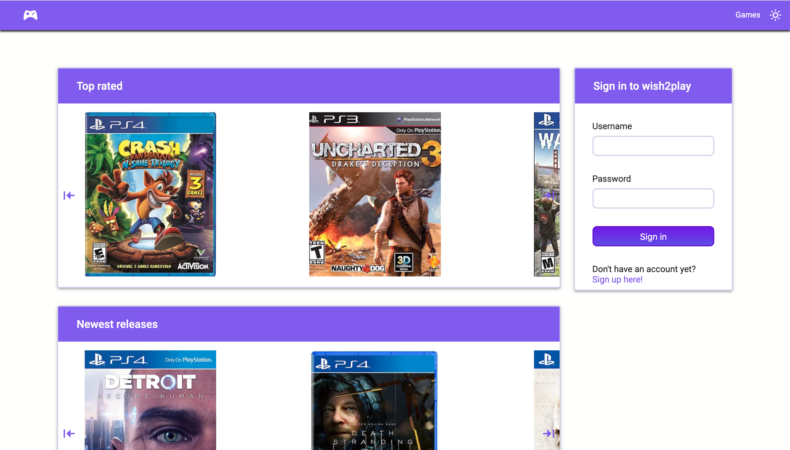
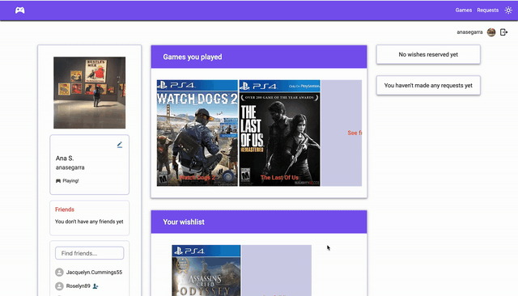
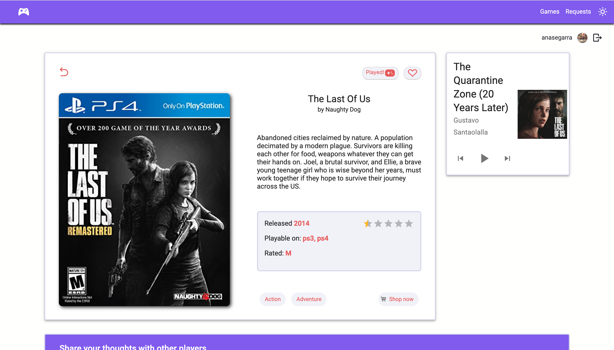

# wish2play

> React App to find videogames and make a wishlist



wish2play is a full stack application that displays a list of videogames handled via RESTful API and it lets users interact with each other and with the games from the platform

## Demo

Live version [https://wish2play.herokuapp.com](https://wish2play.herokuapp.com)

## Installing

To run this project locally do the following after cloning the project:

### Frontend

1. Navigate to client directory with `cd wish2play/client`
2. Run `npm install` to install all the dependencies
3. Create a .env file and include the environment variable `API_URL=http://localhost:3000/api/v1`
4. Run `npm run start-dev` to launch the application on http://localhost:1234/

### Backend

1. Navigate to server directory with `cd wish2play/server`
2. Run `npm install` to install all the dependencies
3. Change [.envExample](https://github.com/anasegarra/wish2play/blob/master/.envExample) file name to .env and paste the required environment variables in the corresponding field
4. Run `npm run dev` to start the server side of the application

## API documentation

| Endpoint          |             Response              |
| ----------------- | :-------------------------------: |
| /api/v1/games     |   retrieved data with all games   |
| /api/v1/games/:id | retrieved data of a specific game |
| /api/v1/filters   |  all genres and platforms in use  |

The API allows to create a new game making a POST request to `/api/v1/games` endpoint when logged as an admin.

Game data has the following schema:

```
  name: {
    type: String,
    unique: true,
    required: true
  },
  description: {
    type: String,
    required: true
  },
  image: String,
  releaseYear: Number,
  platforms: [String],
  linkToBuy: String,
  genres: [String],
  ESRB: {
    type: String,
    enum: ['E', 'E 10+', 'T', 'M', 'A', 'RP'],
    default: 'RP'
  },
  company: String,
  totalRating: {
    type: Number,
    default: 0
  },
  reviews: [{
    type: mongoose.Schema.Types.ObjectId,
    ref: 'Review'
  }]
```

### Games filtering

Filtering is implemented via query parameters:

- Filter by name, genre, platform or ESRB: **?name=_name_**
- Select the fields to receive from the API: **?fields=_name_&fields=_totalRating_** to retrieve game's name and rating
- Sort games by year of release or by rating: **?sortBy=_-releaseYear_** to order games from newest to oldest
- Limit the number of results to return, default is set to a 100: **?limit=_number_**
- Page through the results: **?page=_number_**

## Features



- Home page shows two carousels with the most rated games and the newest releases
- Main page displays a paginated list of games loaded from the API with some info (name, users rating and genres)
- User can search games by name, filter them by genre, platform and ESRB rating and toggle the order of display between newest to oldest release and highest to lowest rating
- Detail game page shows full game's information (synopsis, company, release year, platforms and ESRB rating) as well as a list of reviews from users
- If available, user can play the game's soundtrack fetched from the Spotify API



- User can sign up and login providing username and password. After signing in, user gets redirected to their profile page
- Profile page shows:
  - Editable user's information and picture
  - Paginated lists of current friends and users from the platform to look for via searchbar and befriend
  - Two sliders with games played and wishlist respectively
  - Right side panel displays friend's wishes the user reserved and requests for games submitted by user
- When logged in, user can mark games as played, add them to their wishlist and post reviews, which are editable and deletable
- User can navigate to their games played and wishlist pages as well as the corresponding pages from other users
- User can manage their own wishlist making public their wishes so that friends can reserve them and mark them as fulfilled once they have been completed
- User can visit friend's wishlist and reserve their wishes
- User can make a request to include a game in the platform

**To do:**

- Implement push notifications
- Include statistics charts (i.e., pie chart of genres played by user)
- Improve web design, accessibility and performance
- Code refactoring

## Technologies

[React](https://reactjs.org/)

[Material-UI](https://material-ui.com/)

[Styled Components](https://www.styled-components.com/)

[Styled Icons](https://styled-icons.js.org/)

[Express](https://expressjs.com/)

[Mongoose](https://mongoosejs.com/)

## Overview

This is the last of the three projects made during the Ironhack Web Development Bootcamp. It has been a great experience developing a full stack MERN application from the ground up, not following any kind of guideline or tutorial whatsoever.

## License

Please refer to [LICENSE](https://github.com/AnaSegarra/wish2play/blob/master/LICENSE)

## Author

<table>
<tr><td align="center"><a href="https://github.com/anaSegarra"><br/><sub><b>Ana Segarra</b></sub></a><br/><a href="https://github.com/anaSegarra"></a>
</table>
